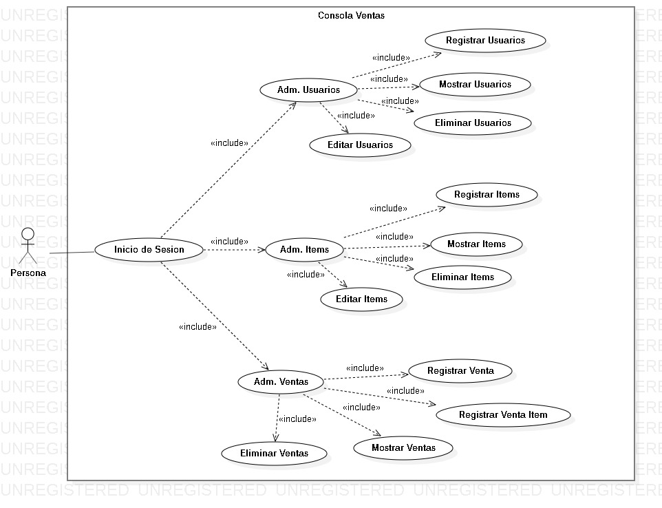

# java-console-edu

Este proyecto es modo consola.

## Pre Requisitos 🚀

1. Instalar Windows 10
2. Instalar Java 1.8.0_201
3. Instalar Gradle 4.4 (optional)

## Instalacion 🔧

1. Clonar Repositorio: `https://github.com/RichardSeverich/java-console-sales.git`
2. Generar el JAR: `gradlew build`
3. Iniciar programa: `java -jar build/libs/java-console-sales.jar`
4. Entrar con: usuario=`micky` contrasena=`micky123`

## Documentacion

### Diagrama Casos de Uso

  

### Diagrama de clases generico

  

### Diagrama de clases de entidades

  

## UI

### Login

  

### Main menu

  

### Users menu

  

### Show users

  

### Items menu

  

### Show items

  

### Sales menu

  

### Show sales

  

